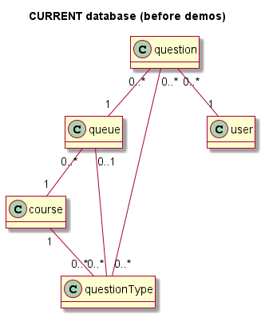
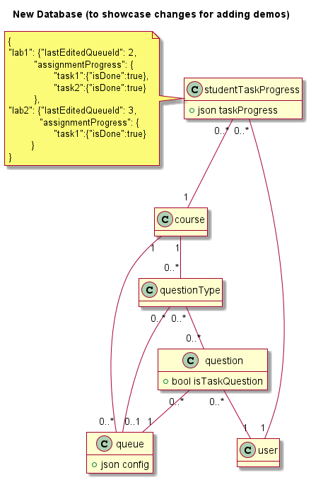
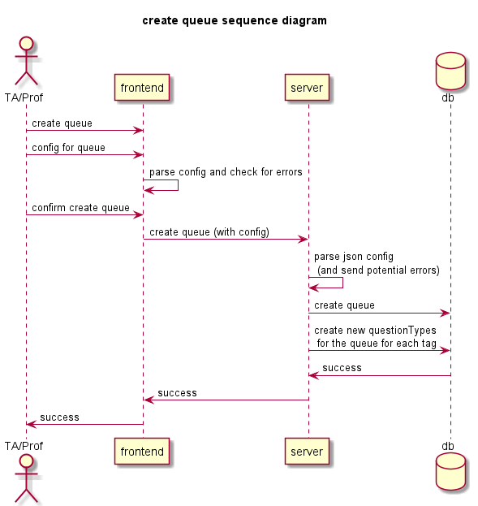
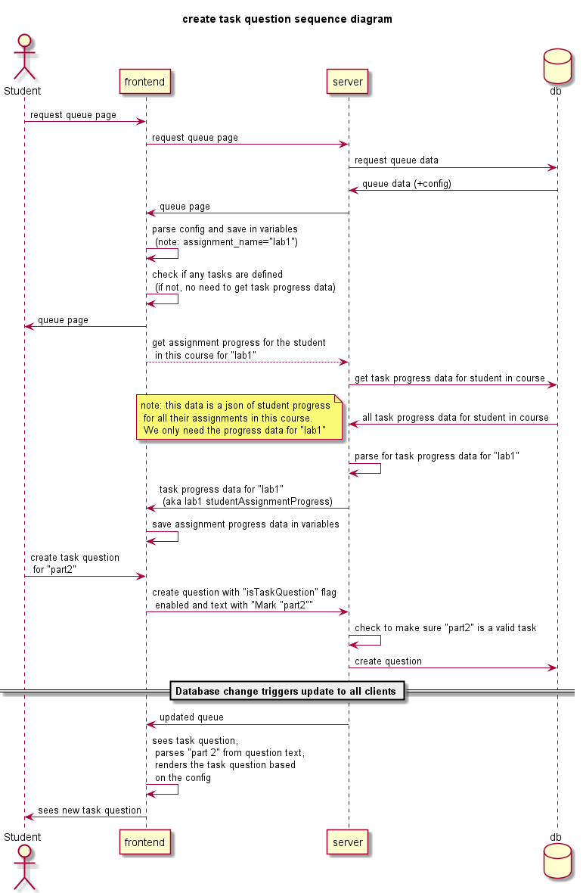
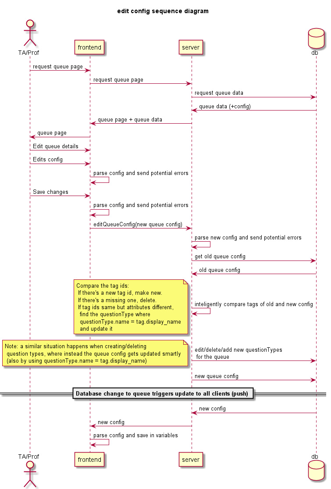
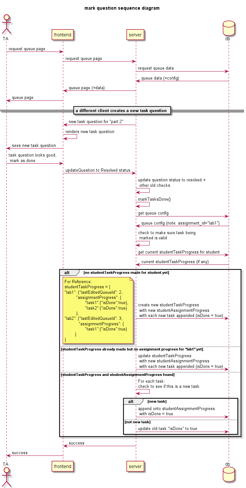

# Intro

These features (listed below) are a list of features that work together to allow users to have "checkable" questions (i.e. questions that can be "checked off" aka demos).

The primary way for professors to define tasks (right now) is through the "queueConfig", which is just a json that profs can write. This also stores other queue-specific settings (see example json below), and should be used to store any new settings that are queue-specific.

The `studentAssignmentProgress`, when combined with the `queueConfig`, allows the student's progress to be displayed on the frontend.  

## Features + Terminology/Definitions
- `StudentTaskProgress` - The progress of all assignments in a course for a student. It looks like this:
```json
{
    "lab1": {
        "lastEditedQueueId": 2,
        "assignmentProgress": {
            "task1": {
                "isDone": true
            },
            "task2": {
                "isDone": false
            },
            "task3": {
                "isDone": false
            }
        }
    },
    "lab2": {
        "lastEditedQueueId": 1,
        "assignmentProgress": {
            "task1": {
                "isDone": false
            },
            "task2": {
                "isDone": false
            }
        }
    }
}
```
- `StudentAssignmentProgress` - The progress for a specific assignment for a student. It looks like this:
```json
{
    "task1": {
        "isDone": true
    },
    "task2": {
        "isDone": false
    },
    "task3": {
        "isDone": false
    }
}
```
- `TaskQuestion`/`Demo`/`CheckableTask` - they mean the same thing. These use the same infrastructure as regular questions except they have `isTaskQuestion`. The tasks themselves are defined in each queue's `config`/`queueConfig`. The parts that the student wants marked is stored in the question text as "Mark "task1" "task2"".
- `config`/`queueConfig` - A json that has a list of attributes that allows the professor to specify `questionTypes`/`tags`, `tasks`, and other stuff. The idea behind it is it allows professors to quickly copy-paste configs between queues or courses. Therefore, if adding a new attribute for queue customization, add it to this config instead of making it a new column. This config is well-synced with the queue and question types, allowing professors to easily "hot-fix" their queues if need be. For more details about what each attribute does, look at `QueueConfigHelp.tsx`. An example one looks like this:
```json
{
    "fifo_queue_view_enabled": true,
    "tag_groups_queue_view_enabled": true,
    "default_view": "fifo",
    "minimum_tags": 1,
    "tags": {
        "tag1": {
            "display_name": "General",
            "color_hex": "#66FF66"
        },
        "tag2": {
            "display_name": "Bugs",
            "color_hex": "#66AA66"
        },
        "tag3": {
            "display_name": "Blocking",
            "color_hex": "#FF0000"
        }
    },
    "assignment_id": "lab1",
    "tasks": {
        "task1": {
            "display_name": "Task 1",
            "short_display_name": "1",
            "blocking": false,
            "color_hex": "#ffedb8",
            "precondition": null
        },
        "task2": {
            "display_name": "Task 2",
            "short_display_name": "2",
            "blocking": false,
            "color_hex": "#fadf8e",
            "precondition": "task1"
        },
        "task3": {
            "display_name": "Task 3",
            "short_display_name": "3",
            "blocking": true,
            "color_hex": "#f7ce52",
            "precondition": "task2"
        }
    }
}
```
- `assignment_id`/`assignmentName` - These are the same thing. On the frontend, it is called `assignment_id` so that professors can understand what it is used for (i.e. don't name it "Laboratory Assignment 3A" and instead "lab3A" for example) and that it's mostly just to identify the assignment, not for display. However, since our IDs are usually numbers, the `assignment_id` is referred to as `assignmentName` in most areas of the system.

## Diagrams
#### Old database

#### New database

#### Create Queue Sequence Diagram

#### Create Task Question Sequence Diagram

#### Edit Queue Config Sequence Diagram

#### Mark Task Question Sequence Diagram
